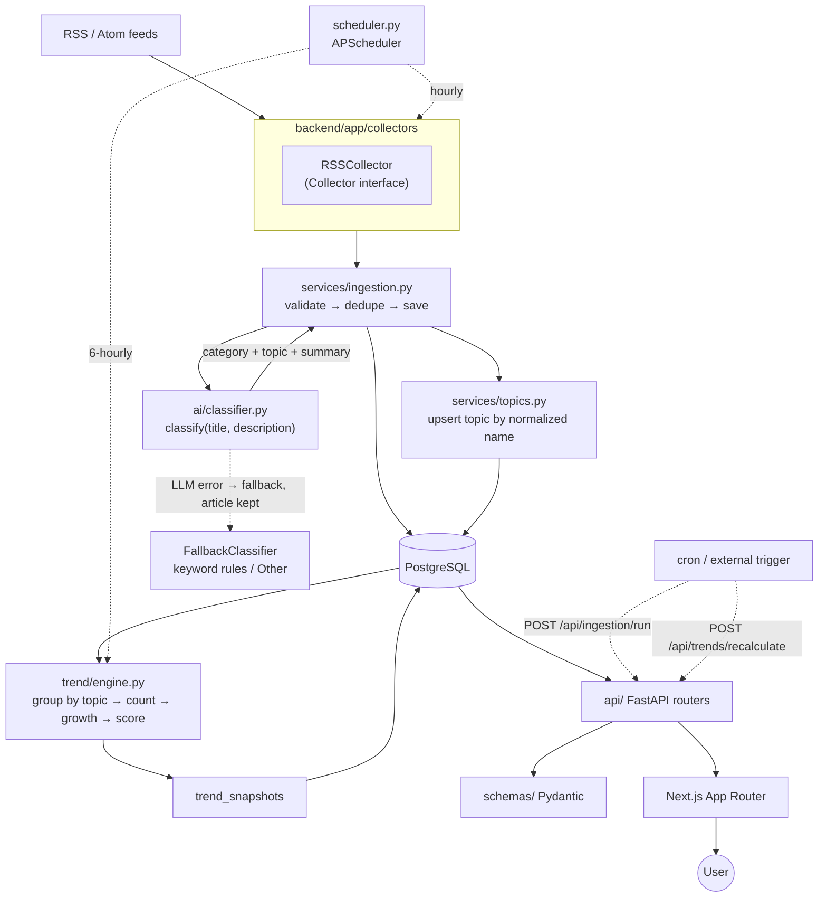

# Trend Tracker — Architecture

Status: MVP design, agreed before implementation (spec §21).

## 1. Review of the proposed architecture

The proposed architecture is sound for an MVP: monotonic data flow (RSS → store → classify →
score → API → UI), one repository, one database, no distributed infrastructure. There is
nothing in it that needs to be removed.

The following points were **underspecified or internally inconsistent** and are resolved by
this document. Each resolution is deliberately the simplest option that satisfies the MVP.

| # | Issue in spec | Resolution |
|---|---|---|
| R1 | §6 `articles` has no uniqueness rule, but §7/§15 require deduplication. | `articles.url` is `UNIQUE`. Ingestion is an upsert-by-URL, so re-running a collector is idempotent. |
| R2 | §6 `article_topics` has only two columns, so the same pair can be inserted twice. | Composite primary key `(article_id, topic_id)` + `confidence` column. |
| R3 | §6 `trend_snapshots` has no uniqueness rule, so recalculating twice duplicates history. | `UNIQUE (topic_id, snapshot_date, window_days)`. Recalculation upserts atomically (ADR-011). |
| R4 | §6 `trend_snapshots` cannot explain its own `growth_rate` later. | Store `previous_count` and `current_count` in the snapshot. |
| R5 | §10 stores nothing about status, so a trend page cannot show historical status. | `status` and `is_emerging` are persisted per snapshot. Thresholds stay in config; only the computed label is stored. |
| R6 | §9 `normalized_volume` has no denominator. | `volume_share = current_count / max(current_count)` where `max` is the busiest topic of the **whole topic population** for that window - never of the topics in the current run. The value is therefore comparable within a period, stable over time, and identical whether a run scores every topic or one (ADR-012). |
| R7 | §9/§10 conflict: "growth > 100% → emerging/growing" then "20–100% → growing". | `previous_count == 0` → `emerging`; growth above `GROWING_THRESHOLD` with non-zero previous → `growing`; `0.20 ≤ growth ≤ 1.00` → `growing` (merged, same label); `-0.20 < growth < 0.20` → `stable`; `growth ≤ -0.20` → `declining`. |
| R8 | §9 says "don't allow infinite growth" but gives no cap. | `growth_rate` is clamped to `EMERGING_GROWTH_CAP` (default `3.0`) when `previous_count == 0`, and the topic is flagged `is_emerging`. |
| R9 | §15 requires "LLM failure must not break ingestion" but §6 has no state for it. | `articles.processing_status` (`pending`/`classified`/`failed`/`skipped`) + `processing_error`. Articles are always committed before classification. |
| R10 | §11 exposes `/api/trends/{slug}`, but `topics.slug` is only unique per category. | `topics.slug` is **globally unique**; collisions get a numeric suffix (`ai-agents`, `ai-agents-2`). Flat URLs, one lookup. |
| R11 | §5 has no `.env` for the threshold config required by §10. | All thresholds, windows, weights and caps live in `backend/app/config.py`, overridable by env vars. |
| R12 | §12 needs an "AI-generated summary" of a **trend**, but §3 only asks the LLM for a per-article summary. | Both: `articles.summary` (one line, from the article) and `topics.summary` (refreshed from the topic's recent titles). Same LLM call path, no new component. |
| R13 | §12/§17 seed data expects trend snapshots, but snapshots are derived. | Seeding generates 45 days of synthetic **articles**, then runs the **real** `TrendEngine` once per day for the last 30 days. Seed data therefore exercises production code instead of faking its output. On a populated database the history is rebuilt only on `--reset` (ADR-009). |
| R14 | §8 allows new topics but never defines the fallback topic. | Every category is seeded with a reserved topic `Other` (`is_fallback = true`). Low-confidence or rejected labels land there. |
| R15 | §14 fetches RSS hourly with no politeness/state controls. | `sources` stores `last_fetched_at`, `last_etag`, `last_modified`, `last_error` so the collector can send conditional requests and skip inactive sources. |
| R16 | §11 requires sorting but sorting on arbitrary client input is a SQL-injection vector. | Sort fields are validated against an explicit whitelist per endpoint; unknown values are rejected with `422`. |
| R17 | Not specified anywhere: multiple scheduler instances against one DB. | Scheduling is opt-in via `RUN_SCHEDULER`; `docker-compose` runs a single API replica. Documented as an MVP constraint. |
| R18 | §8 gives no category for an article the classifier cannot place, and the LLM may name a category outside the five. | `ClassificationResult` carries the literal `"Other"`, never a real category. Ingestion resolves it against the source's `category_id` hint, then the `AI` category as a last resort. A fallback that named a real category would silently dump every unmatched article into whichever category happened to be first. |
| R19 | §12 implies loading states, but a Suspense boundary conflicts with §11's 404 contract. | No `loading.tsx` above any page that calls `notFound()`. A `loading.tsx` streams the shell with HTTP 200 before the page resolves, so a real 404 becomes a 200 with a 404 body. Verified across `/trends/<unknown>`, `/<unknown>` and `/articles/<unknown>`. |

### Scope guardrails honored

No auth, no payments, no microservices, no Kubernetes, no Kafka, no Redis, no vector DB, no
graph DB, no recommendation engine, no streaming, no mobile app. **The LLM never
participates in scoring** — `app/trend/engine.py` imports nothing from `app/ai/`.

## 2. Architecture diagram



Runtime layering (dependencies point downward only):

```text
api/  ──► services/ ──► trend/ , ai/ ──► models/ ──► database.py
  │                                              └──► collectors/
  └──► schemas/   (pure transport types, no DB imports)
```

## 3. Repository structure

```text
trend-tracker/                  (= D:\projects\DuyKhai)
├── backend/
│   ├── app/
│   │   ├── __init__.py
│   │   ├── main.py             FastAPI app, lifespan, exception handlers, CORS
│   │   ├── config.py           Settings (env-driven thresholds, LLM, DB)
│   │   ├── database.py         engine, SessionLocal, Base, get_db
│   │   ├── scheduler.py        APScheduler wiring (Hourly RSS, 6-hourly trends)
│   │   ├── catalog.py          canonical taxonomy: categories, topics, feeds
│   │   ├── cli.py              python -m app.cli init|seed|status|ingest|recalculate|classify
│   │   ├── api/
│   │   │   ├── __init__.py
│   │   │   ├── deps.py         get_db, pagination params, sort whitelist helper
│   │   │   ├── errors.py       AppError + handlers, consistent error envelope
│   │   │   ├── categories.py   /api/categories
│   │   │   ├── trends.py       /api/trends
│   │   │   ├── articles.py     /api/articles
│   │   │   └── ingestion.py    /api/ingestion/run, /api/trends/recalculate, /api/health
│   │   ├── models/             SQLAlchemy 2.0 declarative models
│   │   │   ├── category.py  source.py  article.py  topic.py  snapshot.py
│   │   │   └── associations.py article_topics
│   │   ├── schemas/            Pydantic v2 request/response models
│   │   │   ├── common.py  refs.py  category.py  article.py  trend.py  ingestion.py
│   │   ├── services/           business logic, no HTTP, no SQL-in-route
│   │   │   ├── ingestion.py    collector → validate → dedupe → save → classify
│   │   │   ├── topics.py       topic upsert, slug allocation, fallback topic
│   │   │   ├── trends.py       queries/serialization used by API + jobs
│   │   │   ├── summaries.py    topic summary refresh (LLM, job-driven)
│   │   │   ├── articles.py     article list/detail queries
│   │   │   ├── text.py         normalize/slugify/truncate helpers
│   │   │   └── seed.py         deterministic demo dataset
│   │   ├── collectors/
│   │   │   ├── base.py         Collector ABC + RawArticle dataclass
│   │   │   ├── rss.py          feedparser-based RSS/Atom collector
│   │   │   └── registry.py     name → collector factory (extensibility point)
│   │   ├── ai/
│   │   │   ├── base.py         Classifier ABC + ClassificationResult
│   │   │   ├── llm.py          OpenAI-compatible chat-completions client
│   │   │   ├── fallback.py     keyword classifier (no network, always available)
│   │   │   ├── prompts.py      system/user prompt templates
│   │   │   └── factory.py      picks LLM vs fallback from config
│   │   └── trend/
│   │       ├── windows.py      pure date-window helpers
│   │       ├── scoring.py      pure growth/score/status functions
│   │       └── engine.py       DB orchestration → trend_snapshots upsert
│   ├── tests/
│   │   ├── conftest.py         sqlite in-memory app + client fixtures
│   │   ├── test_scoring.py     growth, score, normalization, status
│   │   ├── test_windows.py     window boundaries
│   │   ├── test_engine.py      recalculation, upsert, scoped runs
│   │   ├── test_ingestion.py   dedupe, missing fields, failure persistence
│   │   ├── test_rss_collector.py parsing, invalid feed, timeout
│   │   ├── test_seed.py        demo dataset + reset safety
│   │   ├── test_cli_and_scheduler.py
│   │   ├── test_classifier.py
│   │   ├── test_catalog.py
│   │   └── test_api.py         endpoints: categories, trends, articles, health
│   ├── requirements.txt
│   ├── requirements-dev.txt
│   ├── pyproject.toml          pytest + ruff config
│   └── Dockerfile
├── frontend/
│   ├── app/
│   │   ├── layout.tsx          shell + nav (categories fetched from API)
│   │   ├── page.tsx            homepage
│   │   ├── error.tsx  not-found.tsx   (no loading.tsx: see R19)
│   │   ├── [category]/page.tsx /ai /technology /finance /gaming /health
│   │   ├── trends/page.tsx     trend list (filters, sort, pagination)
│   │   ├── trends/[slug]/page.tsx
│   │   ├── articles/page.tsx
│   │   ├── articles/[id]/page.tsx
│   │   └── globals.css
│   ├── components/
│   │   ├── Header.tsx  Footer.tsx  CategoryChips.tsx
│   │   ├── TrendCard.tsx  TrendTable.tsx  TrendStatusBadge.tsx
│   │   ├── GrowthChart.tsx     dependency-free SVG sparkline/line chart
│   │   ├── VolumeBar.tsx  ArticleList.tsx  ArticleRow.tsx
│   │   ├── StatCard.tsx  Pagination.tsx  SearchBox.tsx  SortSelect.tsx
│   │   └── EmptyState.tsx  ErrorState.tsx
│   ├── lib/
│   │   ├── api.ts              typed server-side fetch to the backend
│   │   ├── format.ts           percent / number / relative-date formatting
│   │   └── config.ts           API base URL resolution
│   ├── types/api.ts            mirrors backend Pydantic schemas
│   ├── package.json  tsconfig.json  next.config.ts
│   ├── tailwind.config.ts  postcss.config.mjs  eslint.config.mjs
│   └── Dockerfile
├── scripts/
│   └── dev.ps1  dev-backend.ps1  dev-frontend.ps1
├── docs/
│   ├── ARCHITECTURE.md         this file: review, diagram, structure, ADRs
│   ├── DATABASE.md             schema, indexes, constraints
│   └── API.md                  endpoint contract, params, error envelope
├── docker-compose.yml
├── .env.example
├── .gitignore
└── README.md
```

## 4. Architecture decision records

**ADR-001 — Synchronous SQLAlchemy 2.0 with psycopg 3.**
Ingestion and classification are already blocking network I/O (feedparser, HTTP). Making the
whole stack `async` would add an event-loop/session-concurrency layer with no MVP benefit.
FastAPI runs sync `def` endpoints in a threadpool. Simpler to read, simpler to test with
`TestClient`, and SQLite-compatible for tests.

**ADR-002 — Trends are derived; snapshots are a materialized time series.**
`GET /api/trends` reads the latest snapshot per topic for one window (a join against a
`MAX(snapshot_date)` subquery), not a live aggregation. This keeps read latency flat and
makes history a plain `ORDER BY snapshot_date`. Snapshots are written only by
`trend/engine.py`, never by an API route. The join is written without PostgreSQL's `DISTINCT ON` so the identical SQL runs on
SQLite and the API tests exercise the production query shape.

**ADR-003 — Pure functions for all scoring math.**
`trend/scoring.py` and `trend/windows.py` take numbers/dates and return numbers. No DB, no
settings lookups inside. This is what makes spec §16's unit tests trivial and keeps the
algorithm explainable.

**ADR-004 — `Collector` is an abstract interface.**
`RawArticle` is the only currency between collectors and the ingestion service. Adding a
Hacker News or news-API collector later means one new class in `collectors/` plus one registry
entry; the ingestion pipeline is untouched.

**ADR-005 — The classifier is swappable, and its failure is non-fatal.**
`Classifier` ABC with two implementations: `LLMClassifier` and `KeywordFallbackClassifier`.
`ai/factory.py` returns the LLM client when configured and reachable, otherwise the fallback.
Any exception inside classification marks the article `failed` but leaves it committed.
**`app/trend/` never imports `app/ai/`.**

An unrecognised answer is reported as the literal category `"Other"`, not as a real
category. `services/ingestion.py` then resolves it in order: the source's `category_id`
hint, then `AI` as a last resort. This keeps a health feed's unmatched articles out of the
AI counts (R18) — a fallback that named a real category would corrupt every downstream
aggregate the moment the classifier met something it did not recognise.

**ADR-006 — Two ways to trigger work: in-process scheduler and HTTP endpoints.**
`RUN_SCHEDULER=true` starts APScheduler inside the FastAPI lifespan (single replica only).
`POST /api/ingestion/run` and `POST /api/trends/recalculate` do the same work on demand, so
cron/CI/external orchestration needs no scheduler at all. No Celery, no Kafka, no broker.

**ADR-007 — Zero-dependency charting.**
`GrowthChart.tsx` renders inline SVG. A charting library would be the single largest
frontend dependency for one line chart.

**ADR-008 — Every dashboard route is rendered on demand; the API client is uncached.**
Pages declare `dynamic = "force-dynamic"` and `lib/api.ts` fetches with `cache: "no-store"`.
Two reasons: trend data is time-sensitive, and the documented setup builds the frontend
image *before* the database is seeded, so any prerendered or cached response would pin an
empty snapshot until revalidation. This is also why `generateStaticParams` is not used —
it takes precedence over `dynamic` and would make Next.js prerender the category routes.

**ADR-009 — Seeded rows are identified by URL prefix; a destructive wipe is opt-in.**
The demo dataset and real ingested data share `articles`, `article_topics` and `topics`, so
`reset` cannot be a table-wide delete. Every URL the generator writes starts with
`SEED_URL_PREFIX` (`https://seed.trend-tracker.local/`), and `reset_demo_data` deletes only
articles matching that prefix plus their topic links. Topics and categories are never
deleted: they are shared taxonomy that real articles link to, and removing a topic would
cascade into `article_topics` and silently unlink real articles. `seed --reset` therefore
cannot destroy real data. Removing real data is a separate, explicit request:
`--include-ingested`, which wipes every article and snapshot. Consequently a plain `seed`
is additive - snapshot history is rebuilt only on a reset or when the database has no
snapshots at all, and summaries are only generated for topics whose `summary` is still
`NULL`.

**ADR-010 — The schema is created at application startup; there is no migration framework.**
The FastAPI lifespan calls `init_db()` (`Base.metadata.create_all`) with a short bounded
retry (5 attempts, 3 s apart). A database that is briefly unreachable is logged loudly and
the process still starts, because a crash loop would also restart the scheduler; `/api/health`
reports `503 degraded` until the database answers. Deliberately no Alembic (spec 19.1, "do
not over-engineer"). The accepted limitation: `create_all` only issues `CREATE TABLE` for
tables that are absent and never `ALTER`s one that exists, so a column or index added after
a volume was created does not reach it - that needs a manual `ALTER`, `CREATE INDEX` or a
table rebuild. `/api/health` cannot detect it, because the table it probes is present.

**ADR-011 — Snapshot writes are one atomic upsert.**
`persist_snapshots` issues a single dialect-selected `INSERT ... ON CONFLICT
(topic_id, snapshot_date, window_days) DO UPDATE` (PostgreSQL `on_conflict_do_update`,
SQLite for tests). The previous read-then-insert could observe a key as absent in two
overlapping runs (the 6-hourly job against a manual recalculation, or a second replica) and
let the loser fail with a unique violation. Letting the database resolve the conflict makes
concurrent recalculation safe, and keeps re-running the same date idempotent.

**ADR-012 — Volume is normalized against the whole population, never the run's scope.**
`POST /api/trends/recalculate` accepts `topic_id` to score a single topic. The denominator
for `volume_share` is always the busiest topic of *all* topics in the window, not of the
topics being scored. If `topic_ids` narrowed the denominator, a one-topic run would force
`volume_share` to `1.0` and upsert that inflated value over the correct full-run score. A
scoped run inserts or updates only its own rows, but every value it writes equals what a
full run would have written.

**ADR-013 — Error responses never carry raw exception text.**
A response may quote an exception only when we authored the type and its message for
operators - `CollectorError` (`HTTP 404`, `timeout after 15s`, `invalid feed`) is returned
verbatim and stored in `sources.last_error`. Everything else is replaced: a failed storage
write reports `storage failure`, an unexpected ingestion exception reports `unexpected
error during ingestion`, an unhandled request reports `An unexpected error occurred`, and a
`SQLAlchemyError` reports `The database is unavailable`. The detail - driver message, SQL,
bound parameters, traceback - is logged server-side only. Generated SQL easily embeds
column names and parameter values, so an exception string is not safe to return by default.

## 5. Non-goals for this repository

Authentication, multi-tenancy, per-user state, full-text search infrastructure, real-time
updates, alerting, LLM-based scoring, topic merge/split tooling, backfilling on schema change.
All are additive later; none are required by the definition of done in spec §20.
