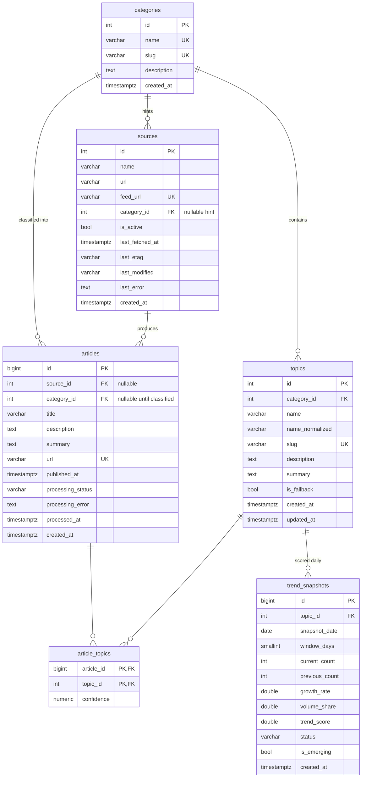

# Database schema

PostgreSQL 16. One database, six tables, no partitioning, no separate analytics store.

Timestamps are `TIMESTAMPTZ` and stored in UTC. All growth/scoring windows are computed in
Python from `articles.published_at`, so no timezone-dependent SQL date math is required.

## Entity relationships



## Tables

### `categories`
Fixed set of five rows, created by `init`/`seed`. `slug` is the public URL segment (`/ai`).

| column | type | constraints |
|---|---|---|
| `id` | `serial` | PK |
| `name` | `varchar(50)` | NOT NULL, UNIQUE |
| `slug` | `varchar(50)` | NOT NULL, UNIQUE |
| `description` | `text` | NULL |
| `created_at` | `timestamptz` | NOT NULL, default `now()` |

### `sources`
One row per RSS/Atom feed. Conditional-request state lives here so the collector can send
`If-None-Match` / `If-Modified-Since` and skip unchanged feeds.

| column | type | constraints |
|---|---|---|
| `id` | `serial` | PK |
| `name` | `varchar(200)` | NOT NULL |
| `url` | `varchar(500)` | NOT NULL (site home page, for attribution) |
| `feed_url` | `varchar(500)` | NOT NULL, UNIQUE |
| `category_id` | `int` | FK → `categories.id` ON DELETE SET NULL, NULL (hint only) |
| `is_active` | `boolean` | NOT NULL, default `true` |
| `last_fetched_at` | `timestamptz` | NULL |
| `last_etag` | `varchar(255)` | NULL |
| `last_modified` | `varchar(255)` | NULL |
| `last_error` | `text` | NULL — cleared on the next successful fetch |
| `created_at` | `timestamptz` | NOT NULL, default `now()` |

### `articles`
`url` is the deduplication key. `category_id` stays NULL until classification succeeds, so a
failed LLM call never blocks storage. `source_id` is NULL for seeded demo articles.

| column | type | constraints |
|---|---|---|
| `id` | `bigserial` | PK |
| `source_id` | `int` | FK → `sources.id` ON DELETE SET NULL, NULL |
| `category_id` | `int` | FK → `categories.id` ON DELETE SET NULL, NULL |
| `title` | `varchar(500)` | NOT NULL |
| `description` | `text` | NULL |
| `summary` | `text` | NULL — short LLM summary |
| `url` | `varchar(1000)` | NOT NULL, UNIQUE |
| `published_at` | `timestamptz` | NOT NULL |
| `processing_status` | `varchar(20)` | NOT NULL, default `'pending'`, CHECK in (`pending`,`classified`,`failed`,`skipped`) |
| `processing_error` | `text` | NULL |
| `processed_at` | `timestamptz` | NULL |
| `created_at` | `timestamptz` | NOT NULL, default `now()` |

### `topics`
A topic belongs to exactly one category. `name_normalized` (lowercased, whitespace-collapsed)
is the upsert key inside a category; `slug` is globally unique for flat `/trends/{slug}` URLs.
Each category has a reserved row with `is_fallback = true` and slug `other`.

| column | type | constraints |
|---|---|---|
| `id` | `serial` | PK |
| `category_id` | `int` | NOT NULL, FK → `categories.id` ON DELETE CASCADE |
| `name` | `varchar(200)` | NOT NULL |
| `name_normalized` | `varchar(200)` | NOT NULL |
| `slug` | `varchar(220)` | NOT NULL, UNIQUE |
| `description` | `text` | NULL |
| `summary` | `text` | NULL — AI-generated trend summary |
| `is_fallback` | `boolean` | NOT NULL, default `false` |
| `created_at` / `updated_at` | `timestamptz` | NOT NULL |

### `article_topics`
Join table. Composite PK makes ingestion idempotent.

| column | type | constraints |
|---|---|---|
| `article_id` | `bigint` | PK part, FK → `articles.id` ON DELETE CASCADE |
| `topic_id` | `int` | PK part, FK → `topics.id` ON DELETE CASCADE |
| `confidence` | `numeric(4,3)` | NULL, 0.000–1.000 |

### `trend_snapshots`
One row per topic per day per window. Written only by `trend/engine.py`; upserted so
recalculation is idempotent.

| column | type | constraints |
|---|---|---|
| `id` | `bigserial` | PK |
| `topic_id` | `int` | NOT NULL, FK → `topics.id` ON DELETE CASCADE |
| `snapshot_date` | `date` | NOT NULL |
| `window_days` | `smallint` | NOT NULL, default `7` |
| `current_count` | `int` | NOT NULL |
| `previous_count` | `int` | NOT NULL |
| `growth_rate` | `double precision` | NOT NULL, clamped to `[-1, EMERGING_GROWTH_CAP]` |
| `volume_share` | `double precision` | NOT NULL, 0.0–1.0 |
| `trend_score` | `double precision` | NOT NULL, 0.0–1.0 |
| `status` | `varchar(20)` | NOT NULL, CHECK in (`emerging`,`growing`,`stable`,`declining`) |
| `is_emerging` | `boolean` | NOT NULL, default `false` |
| `created_at` | `timestamptz` | NOT NULL, default `now()` |

## Indexes and constraints

```sql
UNIQUE  articles(url)
UNIQUE  sources(feed_url)
UNIQUE  categories(name) / categories(slug)
UNIQUE  topics(slug)
UNIQUE  topics(category_id, name_normalized)
UNIQUE  trend_snapshots(topic_id, snapshot_date, window_days)
PK      article_topics(article_id, topic_id)
INDEX   article_topics(topic_id)          -- topic-only lookups; not served by the PK index

INDEX   articles(published_at DESC)
INDEX   articles(category_id, published_at DESC)
INDEX   articles(processing_status) WHERE processing_status IN ('pending','failed')  -- reprocess queue
INDEX   topics(category_id)
INDEX   topics(name_normalized)
INDEX   trend_snapshots(snapshot_date DESC)
INDEX   trend_snapshots(topic_id, snapshot_date DESC)
```

Why these specifically:

* `articles(url)` unique — dedupe (spec §7, §15).
* `articles(published_at DESC)` — every window query and the article list ordered by recency.
  The `published_after` / `published_before` filters compare the raw column against
  timezone-aware UTC bounds (`>= D 00:00Z`, `< D+1 00:00Z`) rather than wrapping it in
  `date(...)`, so the same index serves the range and the predicate stays sargable.
  Semantics are unchanged: both bounds are inclusive of the whole day.
* `(category_id, published_at DESC)` — category page and per-category trend counts.
* Partial index on the reprocess queue — only unclassified rows are ever scanned by
  `POST /api/classify/pending`-style work, so the index stays small as the table grows.
* `trend_snapshots` unique — makes `POST /api/trends/recalculate` safely repeatable.
* `trend_snapshots(snapshot_date DESC)` — "latest snapshot per topic" is the hottest read.
* `article_topics(topic_id)` — a topic id is only the *second* column of the composite
  primary key, so the primary-key index cannot serve a topic-only lookup. Those are hot:
  the topic article counts, the latest-articles list on the trend detail page and the
  scoring engine all filter by `topic_id` alone.

## Applying schema changes to an existing database

There is no migration framework, deliberately (no Alembic; `create_all` only). A fresh
volume gets every table and index above automatically, but `create_all` never ALTERs a
table that already exists, so an index added after the first release does not reach a
database that already holds the old schema. Apply it by hand:

```sql
CREATE INDEX IF NOT EXISTS ix_article_topics_topic_id ON article_topics (topic_id);
```

The statement is idempotent, so it is safe to run on every database. Verify afterwards
with `\d article_topics` (psql) or
`SELECT indexname FROM pg_indexes WHERE tablename = 'article_topics';`.

## Query pattern for "latest snapshot per topic"

```sql
SELECT t.*, tp.*, c.*
FROM trend_snapshots t
JOIN (
    SELECT topic_id, MAX(snapshot_date) AS snapshot_date
    FROM trend_snapshots
    WHERE window_days = :window_days      -- one window only (see below)
    GROUP BY topic_id
) latest
  ON latest.topic_id = t.topic_id
 AND latest.snapshot_date = t.snapshot_date
WHERE t.window_days = :window_days
ORDER BY t.trend_score DESC;
```

Written this way rather than with PostgreSQL's `DISTINCT ON` so the identical query runs
on SQLite and can therefore be covered by the API tests.

Scoping to a single `window_days` is required, not cosmetic. `trend_snapshots` is unique
per `(topic_id, snapshot_date, window_days)`, so if a topic is scored for both a 7-day and
a 30-day window, an unscoped "latest" join matches it twice and the trend list shows the
same topic twice. `services/trends.py` always resolves a concrete window first.

## Growth windows

```text
        previous window        current window
   <---------------------><--------------------->
   snapshot_date - 14d    snapshot_date - 7d   snapshot_date
```

`current_count`  = articles in `[snapshot_date - window_days, snapshot_date)`
`previous_count` = articles in `[snapshot_date - 2*window_days, snapshot_date - window_days)`

Windows are half-open so an article is counted exactly once.
